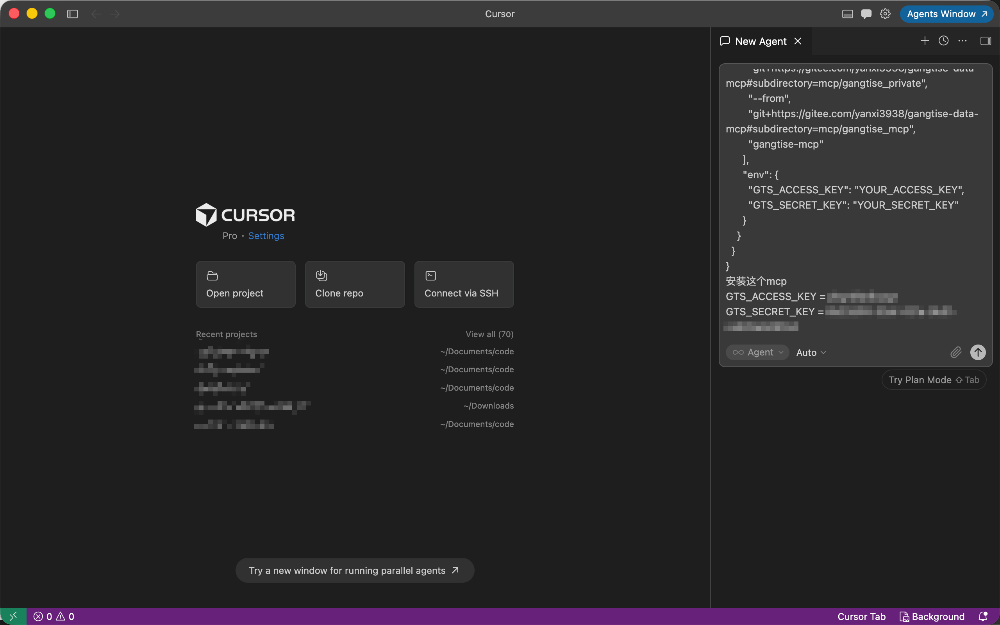
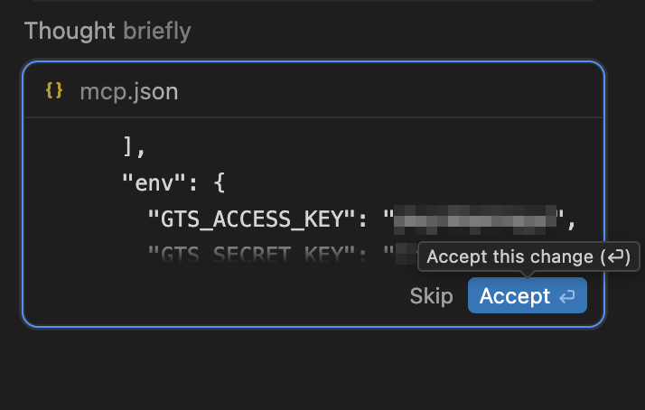
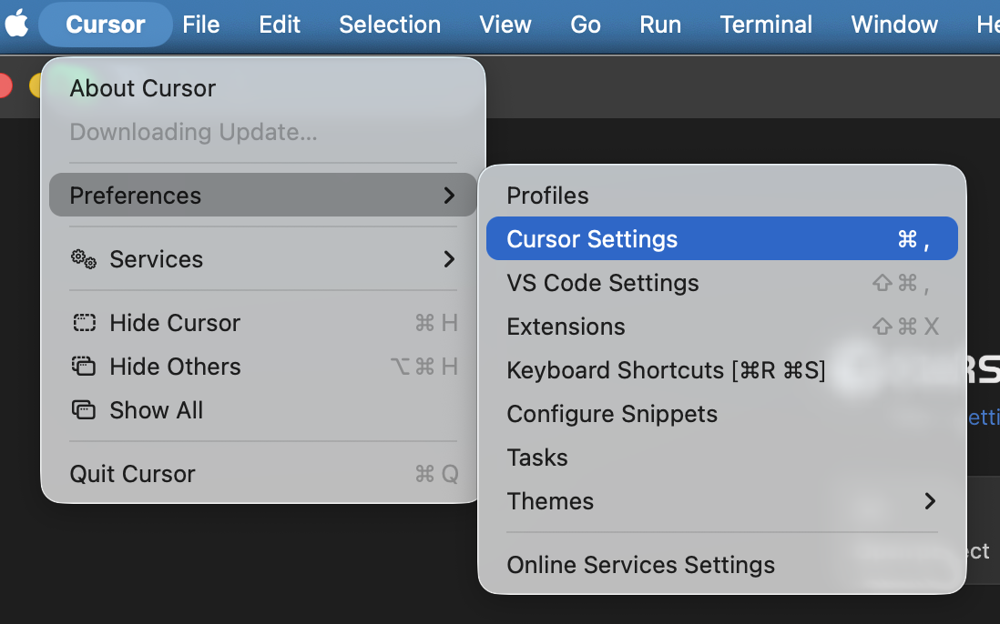
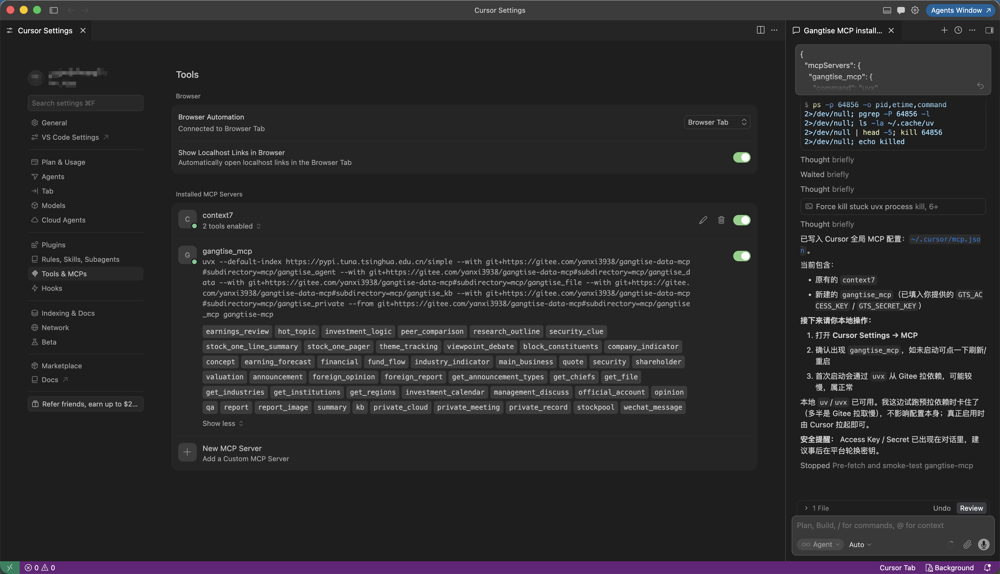
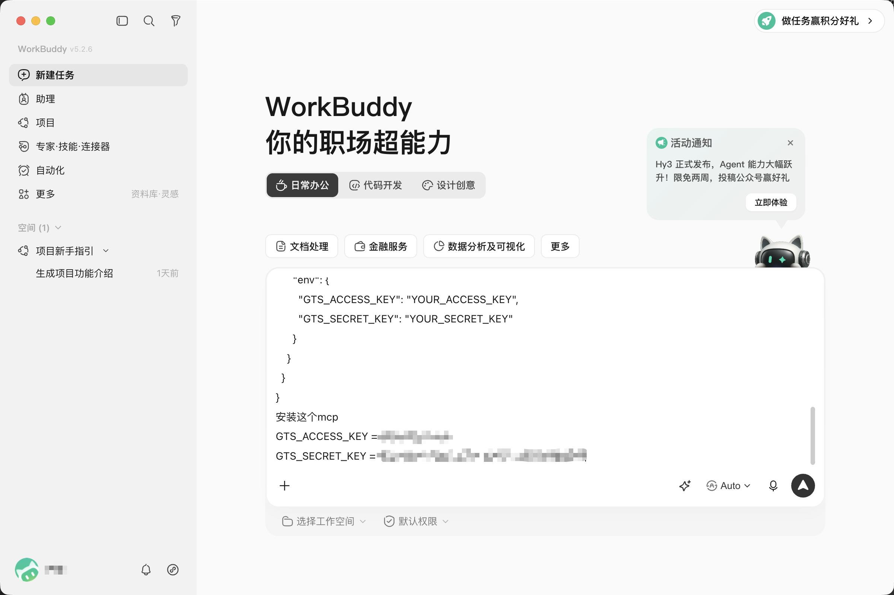
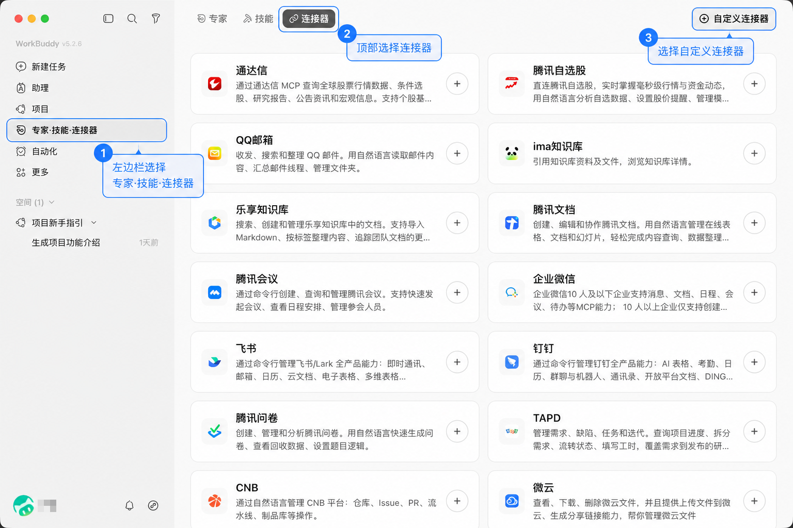
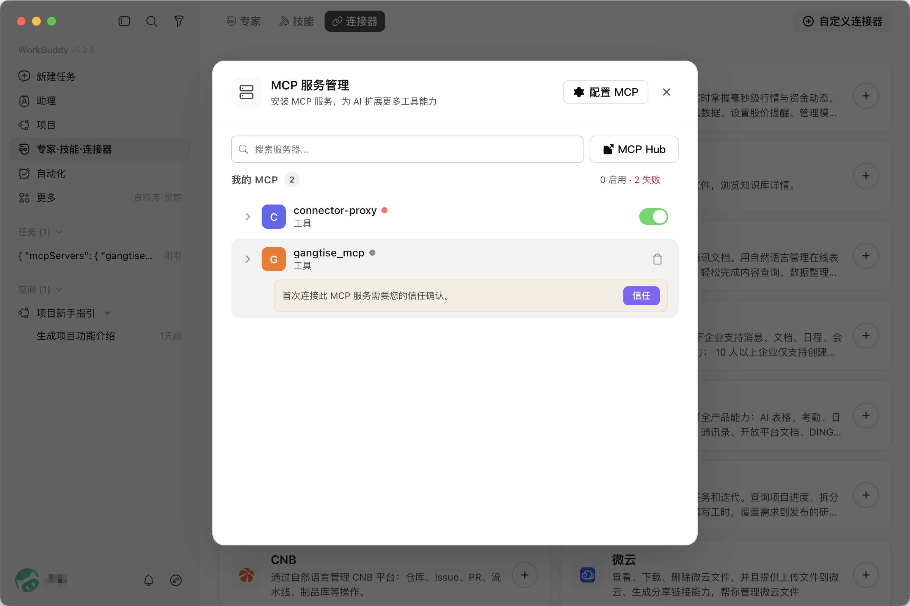

<div align="center">

# Gangtise MCP

**简体中文** | [English](README.md)

基于 [Model Context Protocol](https://modelcontextprotocol.io/) 的 Gangtise 金融数据与研报工具集。  
**推荐使用 [`gangtise_mcp`](mcp/gangtise_mcp/)**：一次挂载五域全部工具。

[账号申请](https://open-platform.gangtise.com/) ·
[HTTP / SSE / OAuth](docs/http-sse.cn.md) ·
[Docker](docs/docker-deploy.cn.md)

</div>

---

## 快速开始

1. 在 [开放平台](https://open-platform.gangtise.com/) 申请账号，于「我的账号 → 账号列表」获取 **Access Key / Secret Key**。
2. 安装 [uv](https://docs.astral.sh/uv/)（本地 stdio 需要）。
3. 按下方客户端说明接入 **推荐包** `gangtise-mcp`。

### 连接方式

| 方式 | 说明 |
|------|------|
| **本地 stdio（推荐起步）** | `uvx` 拉起 `gangtise-mcp`，用环境变量配置 AK/SK |
| **远程 HTTP / SSE** | 部署后连接 `/mcp`；可走 **OAuth 同意页**（客户端只持 Bearer），或请求头带 AK/SK |

仓库地址（本文安装示例均使用 Gitee）：[`https://gitee.com/yanxi3938/gangtise-data-mcp`](https://gitee.com/yanxi3938/gangtise-data-mcp)。英文文档示例见 [README.en.md](README.md)（GitHub）。

---

## 按平台安装（推荐：`gangtise_mcp`）

💬 _对话 / 编程助手_

> **建议**：Cursor、WorkBuddy、Claude、VS Code（含 Copilot / Agent）等带智能体的客户端，优先将下方 MCP 配置 JSON 发给智能体完成安装；亦可手动写入对应配置文件。

<details>
<summary><b>Install in Cursor</b></summary>

1. 将下方 MCP 配置 JSON 发给 Cursor **Agent**（可附带真实 `GTS_ACCESS_KEY` / `GTS_SECRET_KEY`），请其完成安装：

```json
{
  "mcpServers": {
    "gangtise": {
      "command": "uvx",
      "args": [
        "--default-index",
        "https://pypi.tuna.tsinghua.edu.cn/simple",
        "--with",
        "git+https://gitee.com/yanxi3938/gangtise-data-mcp#subdirectory=mcp/gangtise_agent",
        "--with",
        "git+https://gitee.com/yanxi3938/gangtise-data-mcp#subdirectory=mcp/gangtise_data",
        "--with",
        "git+https://gitee.com/yanxi3938/gangtise-data-mcp#subdirectory=mcp/gangtise_file",
        "--with",
        "git+https://gitee.com/yanxi3938/gangtise-data-mcp#subdirectory=mcp/gangtise_kb",
        "--with",
        "git+https://gitee.com/yanxi3938/gangtise-data-mcp#subdirectory=mcp/gangtise_private",
        "--from",
        "git+https://gitee.com/yanxi3938/gangtise-data-mcp#subdirectory=mcp/gangtise_mcp",
        "gangtise-mcp"
      ],
      "env": {
        "GTS_ACCESS_KEY": "YOUR_ACCESS_KEY",
        "GTS_SECRET_KEY": "YOUR_SECRET_KEY"
      }
    }
  }
}
```



2. 若出现改动确认提示，点击 **Accept**：



3. 按菜单路径打开设置：**Cursor → Preferences → Cursor Settings**：



4. 进入 **Tools & MCP**，查看安装状态；若未开启则开启（首次启动可能需等待依赖拉取）：



亦可手动编辑 `~/.cursor/mcp.json` 或项目内 `.cursor/mcp.json`（内容同上）。远程 URL 连接见 [docs/http-sse.md](docs/http-sse.cn.md)。

</details>

<details>
<summary><b>Install in WorkBuddy（腾讯云代码助手）</b></summary>

官方说明见 [WorkBuddy MCP 指南](https://www.codebuddy.cn/docs/workbuddy/From-Beginner-to-Expert-Guide/Function-Description/MCP-Guide)。推荐接入 **`gangtise_mcp`**。

1. 将下方 MCP 配置 JSON 发给 WorkBuddy **智能体**（可附带真实 `GTS_ACCESS_KEY` / `GTS_SECRET_KEY`），请其完成 MCP 安装：

```json
{
  "mcpServers": {
    "gangtise_mcp": {
      "command": "uvx",
      "args": [
        "--default-index",
        "https://pypi.tuna.tsinghua.edu.cn/simple",
        "--with",
        "git+https://gitee.com/yanxi3938/gangtise-data-mcp#subdirectory=mcp/gangtise_agent",
        "--with",
        "git+https://gitee.com/yanxi3938/gangtise-data-mcp#subdirectory=mcp/gangtise_data",
        "--with",
        "git+https://gitee.com/yanxi3938/gangtise-data-mcp#subdirectory=mcp/gangtise_file",
        "--with",
        "git+https://gitee.com/yanxi3938/gangtise-data-mcp#subdirectory=mcp/gangtise_kb",
        "--with",
        "git+https://gitee.com/yanxi3938/gangtise-data-mcp#subdirectory=mcp/gangtise_private",
        "--from",
        "git+https://gitee.com/yanxi3938/gangtise-data-mcp#subdirectory=mcp/gangtise_mcp",
        "gangtise-mcp"
      ],
      "env": {
        "GTS_ACCESS_KEY": "YOUR_ACCESS_KEY",
        "GTS_SECRET_KEY": "YOUR_SECRET_KEY"
      }
    }
  }
}
```



2. 安装完成后，打开侧边栏 **专家 · 技能 · 连接器** → 顶部 **连接器** → **自定义连接器** / **我的 MCP**：



3. 在 **我的 MCP** 中对 `gangtise_mcp`  **信任** gangtise_mcp（首次信任可能等待数秒拉取依赖）：



远程 HTTP：在支持 URL 的连接器配置中填写 `https://<host>:<port>/mcp`（见 [docs/http-sse.md](docs/http-sse.cn.md)）。

</details>

<details>
<summary><b>Install in Claude Desktop</b></summary>

推荐：将下方 MCP 配置 JSON 发给 Claude **智能体 / 对话**，请其写入 MCP 配置并完成安装（可附带真实 AK/SK）。亦可手动编辑 `claude_desktop_config.json`（内容相同）。需已安装 [uv](https://docs.astral.sh/uv/)：

```json
{
  "mcpServers": {
    "gangtise": {
      "command": "uvx",
      "args": [
                "--default-index",
        "https://pypi.tuna.tsinghua.edu.cn/simple",
        "--with",
        "git+https://gitee.com/yanxi3938/gangtise-data-mcp#subdirectory=mcp/gangtise_agent",
        "--with",
        "git+https://gitee.com/yanxi3938/gangtise-data-mcp#subdirectory=mcp/gangtise_data",
        "--with",
        "git+https://gitee.com/yanxi3938/gangtise-data-mcp#subdirectory=mcp/gangtise_file",
        "--with",
        "git+https://gitee.com/yanxi3938/gangtise-data-mcp#subdirectory=mcp/gangtise_kb",
        "--with",
        "git+https://gitee.com/yanxi3938/gangtise-data-mcp#subdirectory=mcp/gangtise_private",
        "--from",
        "git+https://gitee.com/yanxi3938/gangtise-data-mcp#subdirectory=mcp/gangtise_mcp",
        "gangtise-mcp"
      ],
      "env": {
        "GTS_ACCESS_KEY": "YOUR_ACCESS_KEY",
        "GTS_SECRET_KEY": "YOUR_SECRET_KEY"
      }
    }
  }
}
```

</details>

<details>
<summary><b>Install in Claude Code</b></summary>

推荐：将 MCP 配置 JSON（与 Cursor / Claude Desktop 示例相同）发给 Claude Code **智能体**，请其完成安装。亦可使用 CLI：

```bash
claude mcp add gangtise -- uvx \
  --default-index https://pypi.tuna.tsinghua.edu.cn/simple \
  --with "git+https://gitee.com/yanxi3938/gangtise-data-mcp#subdirectory=mcp/gangtise_agent" \
  --with "git+https://gitee.com/yanxi3938/gangtise-data-mcp#subdirectory=mcp/gangtise_data" \
  --with "git+https://gitee.com/yanxi3938/gangtise-data-mcp#subdirectory=mcp/gangtise_file" \
  --with "git+https://gitee.com/yanxi3938/gangtise-data-mcp#subdirectory=mcp/gangtise_kb" \
  --with "git+https://gitee.com/yanxi3938/gangtise-data-mcp#subdirectory=mcp/gangtise_private" \
  --from "git+https://gitee.com/yanxi3938/gangtise-data-mcp#subdirectory=mcp/gangtise_mcp" \
  gangtise-mcp
```

并在对应 MCP 配置中设置 `GTS_ACCESS_KEY` / `GTS_SECRET_KEY`，或使用 shell 环境变量。

</details>

<details>
<summary><b>Install in VS Code</b></summary>

推荐：在 Copilot Chat / Agent 等对话中粘贴下方 JSON，请智能体写入工作区 `.vscode/mcp.json` 并完成安装。亦可手动创建该文件：

```json
{
  "servers": {
    "gangtise": {
      "type": "stdio",
      "command": "uvx",
      "args": [
                "--default-index",
        "https://pypi.tuna.tsinghua.edu.cn/simple",
        "--with",
        "git+https://gitee.com/yanxi3938/gangtise-data-mcp#subdirectory=mcp/gangtise_agent",
        "--with",
        "git+https://gitee.com/yanxi3938/gangtise-data-mcp#subdirectory=mcp/gangtise_data",
        "--with",
        "git+https://gitee.com/yanxi3938/gangtise-data-mcp#subdirectory=mcp/gangtise_file",
        "--with",
        "git+https://gitee.com/yanxi3938/gangtise-data-mcp#subdirectory=mcp/gangtise_kb",
        "--with",
        "git+https://gitee.com/yanxi3938/gangtise-data-mcp#subdirectory=mcp/gangtise_private",
        "--from",
        "git+https://gitee.com/yanxi3938/gangtise-data-mcp#subdirectory=mcp/gangtise_mcp",
        "gangtise-mcp"
      ],
      "env": {
        "GTS_ACCESS_KEY": "YOUR_ACCESS_KEY",
        "GTS_SECRET_KEY": "YOUR_SECRET_KEY"
      }
    }
  }
}
```

HTTP 远程：将 `type` 改为 `http`，并设置 `url` 为 `https://<host>:<port>/mcp`。

</details>

<details>
<summary><b>远程 HTTP / SSE（OAuth 或请求头）</b></summary>

部署见 [docs/docker-deploy.md](docs/docker-deploy.cn.md)。客户端连接示例：

```
https://<host>:<port>/mcp
```

- **OAuth（推荐）**：配置 `GTS_JWT_SECRET` / `GTS_CRED_ENC_KEY` 后，客户端可打开 `/authorize`，用户填写 AK/SK；之后只带 Bearer（access 1h / refresh 30d）。
- **请求头**：`X-GTS-Credentials: {"accessKey":"...","secretKey":"..."}`。

协议与端点细节：[docs/http-sse.md](docs/http-sse.cn.md)。

</details>

---

## 包一览

| 包 | 命令 | 说明 |
|----|------|------|
| **[mcp/gangtise_mcp](mcp/gangtise_mcp/)**（推荐） | `gangtise-mcp` | 五域全部工具 |
| [mcp/gangtise_hub](mcp/gangtise_hub/) | `gangtise-hub-mcp` | 类似skill理念，基础仅 5 个域入口，渐进 list/read_ref/call |
| [mcp/gangtise_agent](mcp/gangtise_agent/) | `gangtise-agent-mcp` | 研报 Agent |
| [mcp/gangtise_data](mcp/gangtise_data/) | `gangtise-data-mcp` | 行情 / 财务 / 估值等 |
| [mcp/gangtise_file](mcp/gangtise_file/) | `gangtise-file-mcp` | 研报 / 公告 / 纪要等 |
| [mcp/gangtise_kb](mcp/gangtise_kb/) | `gangtise-kb-mcp` | 知识库 |
| [mcp/gangtise_private](mcp/gangtise_private/) | `gangtise-private-mcp` | 云盘 / 会议 / 股池等 |

单域用法见各包 README；日常优先 `gangtise_mcp`。

---

<details>
<summary><b>源码结构（mcp stdio / api HTTP·SSE / cli）</b></summary>

| 目录 | 职责 |
|------|------|
| [`mcp/`](mcp/) | 业务脚本真源 + **stdio** MCP（Cursor / 本地） |
| [`api/`](api/) | **HTTP/SSE** MCP + OAuth/鉴权（依赖对应 mcp 业务包） |
| [`cli/`](cli/) | 命令行（依赖对应 mcp；全量命令 `gangtise`） |

`gangtise_hub` / `gangtise_mcp` **不内嵌**五域代码，运行时依赖五个域包。  
stdio：`cd gangtise-data-mcp/mcp/<pkg> && uv sync && uv run <mcp 命令>`。  
HTTP：`cd gangtise-data-mcp/api/<pkg> && uv sync && uv run <api 命令>`。  
同步：`python3 sync_skills_to_mcp.py`（业务写入 `mcps/mcp/`；鉴权真源在 `api/gangtise_agent`）。

</details>

<details>
<summary><b>环境变量摘要</b></summary>

| 变量 | 说明 |
|------|------|
| `GTS_ACCESS_KEY` / `GTS_SECRET_KEY` | stdio / 进程级凭证 |
| `GTS_AUTHORIZATION_PATH` | 凭证文件路径（可选） |
| `GTS_JWT_SECRET` / `GTS_CRED_ENC_KEY` | 远程 OAuth（Fernet key：`python -c "from cryptography.fernet import Fernet; print(Fernet.generate_key().decode())"`） |
| `GTS_OAUTH_ISSUER` | 反代后的对外 issuer URL |
| `GTS_SAVE_FILE` / `WORK_PATH` | 是否落盘 / 工作区 |
| `GTS_MCP_ROOT` | gateway 根（容器默认 `/opt/mcp`，含 `api/`+`mcp/`） |
| `MCP_ATTACH_MAX_BYTES` / `OBS_*` | 附件上限与可选 OBS，见 [docs/docker-deploy.md](docs/docker-deploy.cn.md) |

未配置凭证时仍可握手与 `tools/list`；调用工具时会提示前往开放平台申请。

</details>

<details>
<summary><b>Docker 一键</b></summary>

```bash
cd gangtise-data-mcp
docker build -t gangtise-mcp -f Dockerfile \
  --build-arg PIP_INDEX_URL=https://pypi.tuna.tsinghua.edu.cn/simple \
  --build-arg PIP_TRUSTED_HOST=pypi.tuna.tsinghua.edu.cn \
  .
docker run -d -p 8000:8000 \
  -e GTS_JWT_SECRET='change-me' \
  -e GTS_CRED_ENC_KEY="$(python3 -c 'from cryptography.fernet import Fernet; print(Fernet.generate_key().decode())')" \
  gangtise-mcp
```

详见 [docs/docker-deploy.md](docs/docker-deploy.cn.md)。

</details>

---

问题与支持：通过开放平台账号体系获取凭证；文档问题可提 Issue。English：[README.en.md](README.md)。
